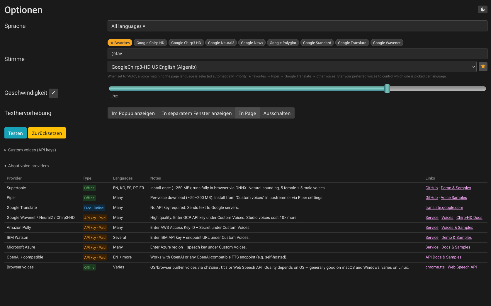

# Read Aloud

Firefox extension with a redesigned settings UI, in-page highlighting, favorites, and an offline TTS engine.

See the [upstream repo](https://github.com/ken107/read-aloud) for general documentation, architecture, and API key setup.

---

## Screenshots

**Redesigned settings page** — dark mode, voice filter chips, favorites, segmented highlighting control:

**In-page highlighting** — Speechify-style sentence overlay with hover preview and amber playback highlight:

---

## Changes from upstream

### Settings UI overhaul
- **Voice filter chips** — clickable chips per provider/model family (Google Neural2, Google Chirp3-HD, etc.) instead of typing; one chip per family, not per language accent
- **Favorites** — star button next to the voice dropdown; starred voices appear in a gold "★ Favorites" chip that filters the dropdown to just your picks
- **Language picker** (`Sprache`) — inline checkbox dropdown above the voice selector, no separate tab
- **Highlighting** — three-button segmented control (Popup / Window / Off / In Page) instead of a dropdown
- **Speed slider** shows live value while dragging; edit button switches to a manual number input
- **Voice grouping** — dropdown split into Offline Voices / Online – Free / Cloud Voices / Experimental AI Voices
- **Removed** pitch and volume controls (volume is set at OS level; pitch is rarely useful)
- **Removed** native browser voices (espeak etc.) from the dropdown — poor quality
- **Removed** empty optgroup separators from the voice dropdown
- **Removed** static shortcut keys section (doesn't reflect user-customized shortcuts)
- Custom voices (Amazon Polly, Google Wavenet, IBM Watson, Azure, OpenAI) embedded as collapsible sections inline — no separate tab
- Voice dropdown only shows voices that will actually work (hides Amazon Polly without AWS keys, etc.)
- Right-click extension icon → **Open settings** context menu
- Increased row spacing in the settings grid
- **Dark mode toggle** button in the options page header
- **"About voice providers"** collapsible table — all providers with type (offline/free/paid), supported languages, notes, and links to docs and voice samples
- **Auto-select hint** below the voice dropdown explains language-matching behavior and favorites priority

### In-page highlighting
New **In Page** option in the highlighting control (alongside Popup / Window / Off):
- **Hover preview** — moving the mouse over the page shows a purple highlight around the sentence under the cursor
- **Playback highlight** — the currently-spoken sentence is highlighted in amber directly on the page; updates every ~300 ms
- Per-line SVG rects track the exact sentence geometry, including across line breaks; inline elements (links, bold) don't cause double-painting
- **Click to seek** — click any sentence while TTS is playing or paused to jump to that exact sentence; does nothing when TTS is stopped
- Highlighted sentence scrolls to 25% from the top of the viewport
- Highlighting is driven by the player (persists after popup is closed)

### Supertonic TTS (offline, on-device)
- Bundled Supertonic TTS engine running entirely in-browser via ONNX Runtime Web (WASM backend) in a Web Worker — no external service
- Models (~250 MB) downloaded on demand from HuggingFace and cached in the browser Cache API (persistent, not subject to cache eviction)
- **Install:** select "Supertonic Stimmen installieren…" in the voice dropdown; progress is shown inline; the 10 voices (F1–F5, M1–M5) appear only after download completes
- Models are loaded from cache into the Worker on first use per session; subsequent sentences in the same session are instant
- Supports en / ko / es / pt / fr
- Dash-between-phrases is normalized to a comma before inference for more natural pausing

### Auto-select voice
When no specific voice is selected, a voice matching the **page language** is picked automatically. Priority order:

1. **Favorited voice matching the page language** — whichever matching favorite you starred first wins
2. Piper
3. Google Translate
4. Other voices

The currently auto-selected voice is shown as `Auto: <voice name>` below the dropdown.

To control which voice is picked for a language: star voices in your preferred order. The first favorited voice that supports the page language is used. To change priority, unfavorite and re-favorite in the desired order.

### Playback behavior
- Changing settings (rate, voice, etc.) no longer stops playback — the player re-reads settings per sentence, so changes take effect at the next sentence boundary
- Rate change via keyboard shortcut applies mid-playback (was broken for auto-select due to key mismatch)

### Speed shortcuts
Two new commands (assign keys in `about:addons → Manage Extension Shortcuts`):
- **Speed up** (`rate-up`): +0.1×
- **Slow down** (`rate-down`): −0.1×

Rate changes apply at the next sentence boundary without interrupting playback.

### Popup improvements
- **Speed buttons** — `−` / `+` buttons in the popup for quick speed adjustment without opening settings

### Text extraction improvements
- Better block detection for rich-text editors (Draft.js, X/Twitter): span-only paragraphs without block-level children are now recognized as text blocks
- Short `
` and bold-styled elements treated as pseudo-headings for correct reading order

### Firefox compatibility
- Background page uses `scripts` array instead of `service_worker` (MV3 Firefox requirement)

### Removed upstream features
- `languages.html` per-language voice picker (replaced by the inline language filter + favorites)
- `preferredVoices` storage key (superseded by `favoriteVoices`)
- Remote announcements banner in popup

---

## Installing

### Firefox (recommended)

This addon is distributed as an unlisted extension via Mozilla AMO — it's signed by Mozilla but not publicly listed in the addon directory.

1. Download the latest `.xpi` file from the [Releases](../../releases) page
2. In Firefox, go to `about:addons`
3. Click the gear icon → **Install Add-on From File…**
4. Select the downloaded `.xpi`

The addon will be installed and signed — no developer mode required.

### Firefox (development / from source)

1. Clone this repo
2. Go to `about:debugging` → This Firefox → Load Temporary Add-on
3. Select `manifest.json` from the repo root

Note: temporary addons are removed on Firefox restart.

---

## Support

If you find this useful, consider buying me a coffee:

